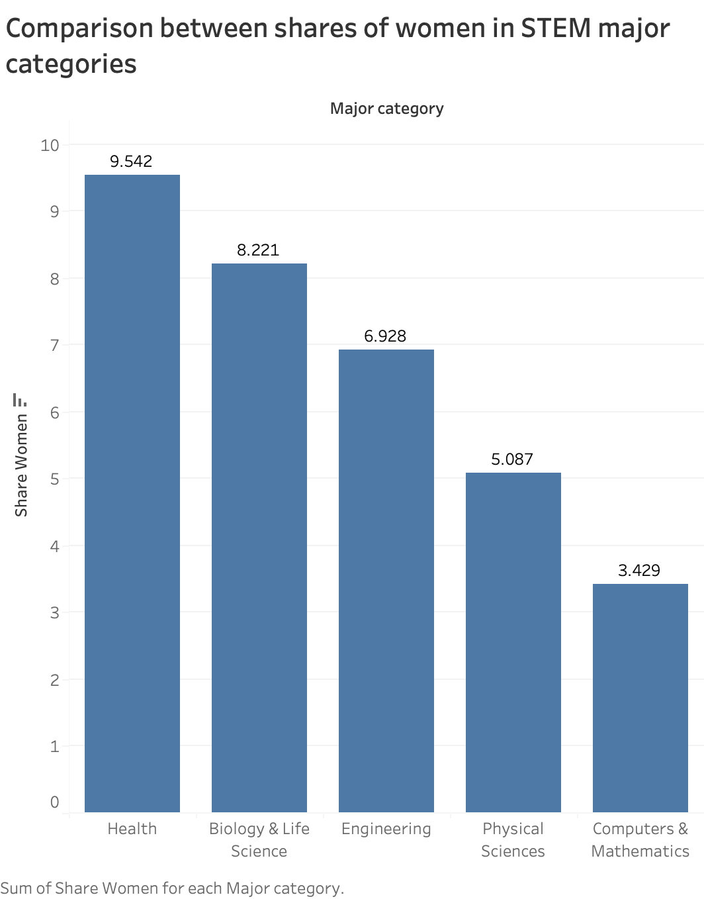
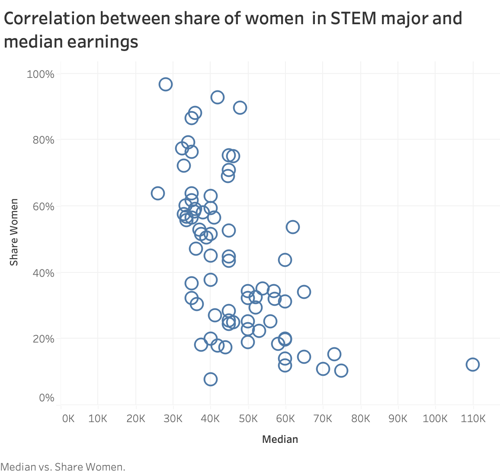
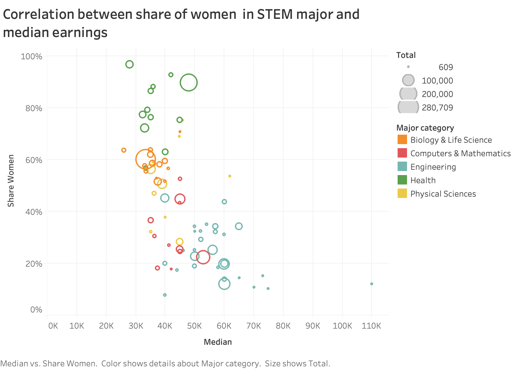
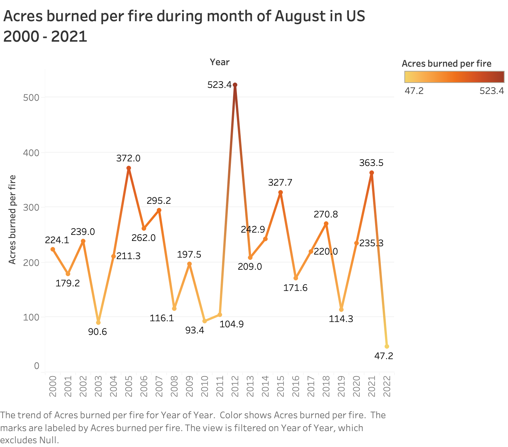

Arrange Tables In - Class Activity, CS 625, Spring 2023
================
Suprabha Pandey
2023-02-9

## QUESTIONS

**Q1.** Compare the share of women in the STEM major categories (Biology
& Life Science, Computing & Mathematics, Engineering, Health, Physical
Sciences).

**Answer.** For this question I have plotted Bar Chart graph in Tableau
as we were asked to “compare the share of women in STEM major
categories” and for comparison Bar Graph is the best choice as we
studied in the class.

*Data Items* - “Share of Women”, “Major Categories” \* *Marks* - Line

*Data Attributes* \* *Channels* - Vertical position, Horizontal
position, length

*Data Types* \* *Attribute* - For Bar chart we “Categorical” but as we
have year in the x axis which is time and time is a continuous interval
variable so its “Quantitative”

``` r
knitr::include_graphics("//Users/suprabhatripathi/Documents/GitHub/In-Class Activity/Comparison.png")
```
<p align="center">
  
</p>
<!-- -->

I aggregrated data by showing it in Ascending order of the result, As
Health Science shows much higher Share of women so it is showing in
first.

**Q2.** Is there a correlation between the share of women in a STEM
major and that major’s median earnings? Are there outliers from the
norm?

Related: How does the major category play into this relationship? What
about the total number of students in that major?

**Answer.** For this Question I have plotted Scatter plot in Tableau as
we were to asked to show the “Correlation” and it can be easily
identified in Scatter plot. For the 2nd part of this Questions I have
added “Size” to the “Total number of students” and “Color” to the “Major
Category” I aggregate share of women by showing it in percentage. *Data
Items* - “Share of Women” , “Median” \* *Marks* - Circle

*Data Attributes* \* *Channels* - Vertical position, Horizontal
position, Color hue, Size

*Data Types* \* *Attribute* - As this Graph shows the relationship
between two variables measured for the same individuals so it is
“Quantitative”(Please refer 1st image)

``` r
knitr::include_graphics("//Users/suprabhatripathi/Documents/GitHub/In-Class Activity/Correlation1.png")
```
<p align="center">
  
</p>
<!-- --> But as I extended it by adding a Group in
this as “Major category” and “Total Number of Students” so now it become
categorical.(Please refer 2nd image)

``` r
knitr::include_graphics("//Users/suprabhatripathi/Documents/GitHub/In-Class Activity/Correlation2.png")
```
<p align="center">
  
</p>
<!-- --> From this graph we can see Women in
“Health and Science” major has maximum has highest share and women in
“Engineering” major has lowest share but they do have highest salary as
compared with the other’s major.

**Q3.** What is the trend in the number of acres burned per fire during
the month of August in the US between 2000-2021?

**Answer.** For this Question, I have plotted a Line chart, as we were
asked to show “Trend” and Line chart is the best choice to show the
trend and fluctuations in data over time.

Also, I have applied filter to show data from 2000 till 2021

I aggregate Year of X axis and shown it in Date’s Year format.

*Data Items* - Year, Acres per fire \* *Marks* - Line

*Data Attributes* \* *Channels* - Vertical Position, Horizontal Position

*Data Types* \* *Attribute* - It is “Quantitative” as its is showing
“Acres burned per fire” over year, and time cannot be categorical. Also,
Acres represents size.

``` r
knitr::include_graphics("//Users/suprabhatripathi/Documents/GitHub/In-Class Activity/trend.png")
```
<p align="center">
  
</p>
<!-- --> From this graph as we can see we have highest
“Acres burned in 2012” and its is fluctuating since then.

## REFERENCES

- Categorical and Quantitative -
  <https://www.fullstory.com/blog/categorical-vs-quantitative-data/>

- Embed Tableau link -
  <https://kb.tableau.com/articles/howto/embedding-tableau-public-views-in-iframes>

- Spectrum Color in Line chart -
  <https://help.tableau.com/current/pro/desktop/en-us/viewparts_marks_markproperties_color.htm>
